# 🍕 Domino's Pizza SQL Sales Analysis & Business Intelligence

A portfolio data analytics case study analyzing **21,350 customer orders** and **49,574 pizza sales** across 2015 using **MySQL 8.0**, relational database modeling, and business data storytelling.

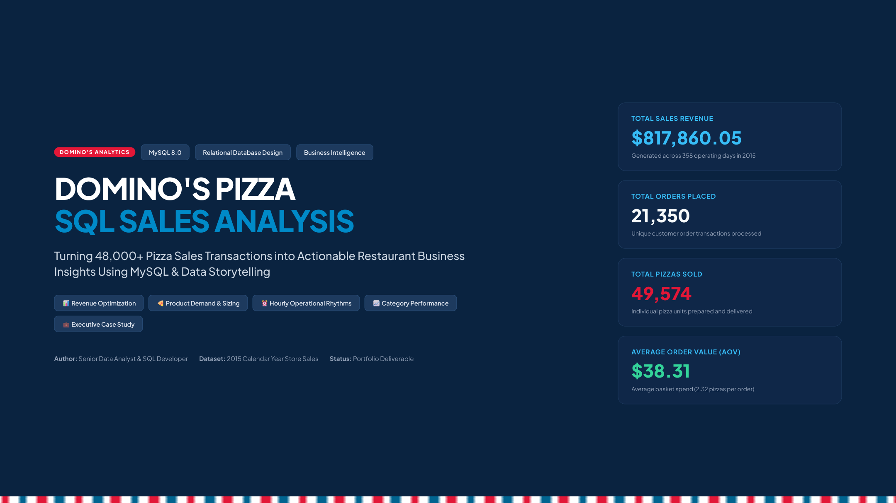

---

## 📌 About This Project

In quick-service restaurants like Domino's, operational success comes down to a few critical questions: Which pizzas actually bring in the most money? When are the ovens under the highest load? Are we carrying menu items that take up kitchen prep time without pulling their weight?

In this project, I built a relational MySQL database from raw sales data, wrote and optimized queries to answer key business questions, and translated those SQL outputs into practical recommendations for restaurant managers, inventory planners, and shift supervisors.

### 📄 Deliverables in this Repo:
- **[Dominos_SQL_Analysis_Project.pdf](Dominos_SQL_Analysis_Project.pdf)**: Complete 16-slide executive presentation deck.
- **[Dominos_SQL_Analysis_Project.pptx](Dominos_SQL_Analysis_Project.pptx)**: Fully editable PowerPoint deck.
- **[Dominos_CreateTable.sql](Dominos_CreateTable.sql)**: Database creation and table definitions with primary/foreign keys.
- **[Dominos_Query.sql](Dominos_Query.sql)**: All 11 analytical queries used in the analysis.
- **[Validation_Notes.md](Validation_Notes.md)**: Technical audit notes, cross-engine checks, and query validation details.
- **[Query_Results/](Query_Results/)**: Individual CSV result files for every query.

---

## 🎯 Executive Dashboard & Key Numbers

Here is a quick snapshot of the core business metrics calculated across the entire 2015 calendar year (358 operating days):

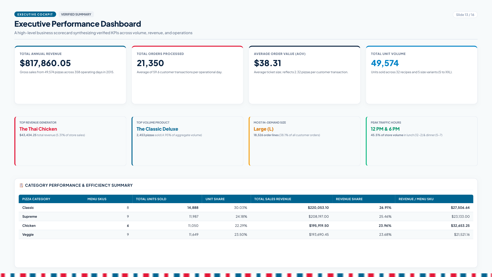

| Key Metric | Query Output | Business Context |
| :--- | :--- | :--- |
| **Total Revenue** | **$817,860.05** | Calculated from line items (`SUM(quantity * price)`) |
| **Total Orders** | **21,350** | Distinct customer transactions (averaging ~60 orders/day) |
| **Total Pizzas Sold** | **49,574 units** | Physical pizzas baked and delivered |
| **Average Order Value (AOV)** | **$38.31** | Average revenue per order ticket |
| **Average Items / Order** | **2.32 pizzas** | Indicates most orders are group/family meals rather than single diners |
| **Top Revenue SKU** | **The Thai Chicken Pizza** | $43,434.25 total revenue |
| **Top Volume SKU** | **The Classic Deluxe Pizza** | 2,453 pizzas sold |
| **Most Popular Size** | **Large (L)** | 38.1% of all order lines (18,526 lines / 18,956 units) |
| **Peak Rush Windows** | **12:00 PM & 6:00 PM** | 45.5% of total orders land in four hours (12-2 PM & 5-7 PM) |

---

## 🏗️ Database Architecture & Relational Schema

The database follows a normalized relational model split into four tables to prevent redundancy and keep transactional logging fast:

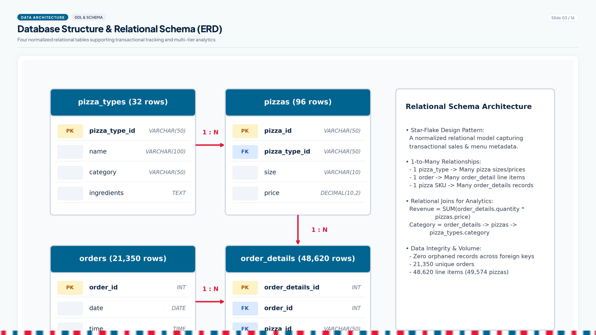

### The 4 Core Tables:
1. **`pizza_types` (32 rows):** Contains the master recipe name, category (`Classic`, `Chicken`, `Supreme`, `Veggie`), and list of ingredients.
2. **`pizzas` (96 rows):** Specific product SKUs with size codes (`S`, `M`, `L`, `XL`, `XXL`) and prices. Linked to `pizza_types` via `pizza_type_id`.
3. **`orders` (21,350 rows):** Header records capturing `order_id`, transaction `date`, and `time`.
4. **`order_details` (48,620 rows):** Line-item records detailing each pizza SKU and quantity purchased per order.

Every foreign key was audited before querying; there are **zero orphaned records** between tables.

---

## 🔍 Detailed Analysis & SQL Walkthrough

### 1. Overall Revenue & Order Volume (Queries 1 & 2)

```sql
-- Query 1: Total orders placed
SELECT COUNT(order_id) AS Total_orders 
FROM orders;

-- Query 2: Total sales revenue
SELECT ROUND(SUM(o.quantity * p.price), 2) AS Total_revenue 
FROM order_details o 
LEFT JOIN pizzas p ON o.pizza_id = p.pizza_id;
```

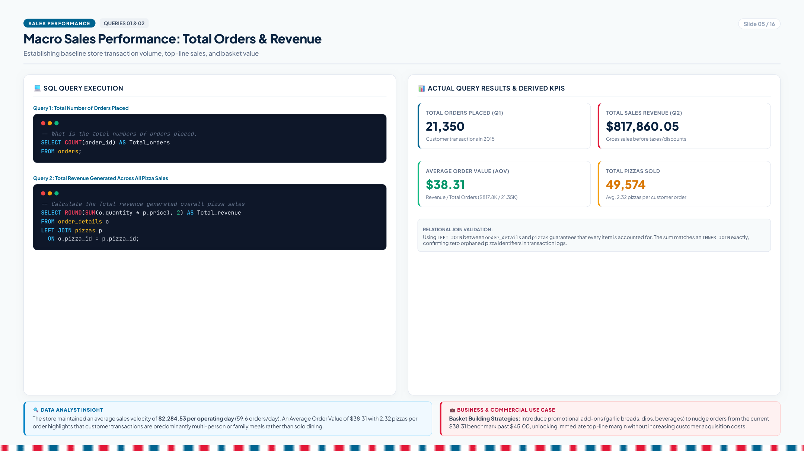

- **What the data shows:** The store brought in **$817,860.05** across **21,350 orders**, translating to an Average Order Value of **$38.31**.
- **Analyst Note:** Because orders average 2.32 pizzas each, customers are rarely buying just for themselves. Domino's is primarily catering to dinner tables, game nights, and workplace lunches.

---

### 2. Pricing vs. What Customers Actually Buy (Queries 3 & 4)

```sql
-- Query 3: Highest-priced pizza
SELECT pt.name, p.price 
FROM pizzas p 
JOIN pizza_types pt ON p.pizza_type_id = pt.pizza_type_id 
ORDER BY p.price DESC LIMIT 1;

-- Query 4: Most common pizza size ordered
SELECT p.size, COUNT(od.order_id) AS TotaL_Order 
FROM pizzas p 
JOIN order_details od ON p.pizza_id = od.pizza_id 
GROUP BY p.size
ORDER BY TotaL_Order DESC;
```

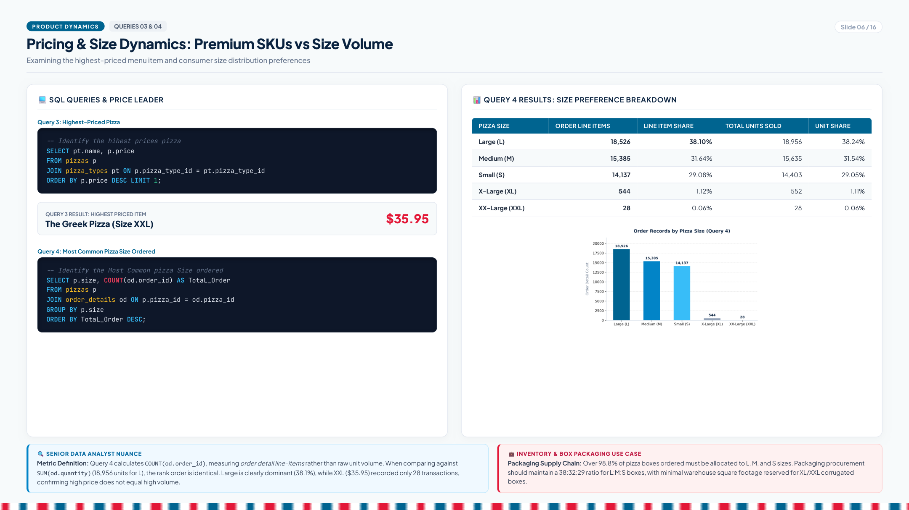

- **What the data shows:**
  - **Highest price:** The Greek Pizza in size XXL costs **$35.95**.
  - **Size Breakdown:**
    - **Large (L):** 18,526 order lines (38.1%)
    - **Medium (M):** 15,385 order lines (31.6%)
    - **Small (S):** 14,137 order lines (29.1%)
    - **X-Large (XL):** 544 order lines (1.1%)
    - **XX-Large (XXL):** 28 order lines (0.06%)
- **Data Analyst Nuance:**
  Notice that Query 4 uses `COUNT(od.order_id)` — this measures the number of *line-item records* where a size was ordered. If we measure physical pizzas (`SUM(od.quantity)`), Large accounts for 18,956 pizzas (38.2%). In both measures, customer demand heavily favors Large, Medium, and Small. The XXL size only had 28 orders all year — a great reminder that having the highest price tag doesn't make a product a meaningful revenue driver.

---

### 3. Hero Products: Top 5 by Volume (Query 5)

```sql
-- Query 5: Top 5 most ordered pizza names by quantity
SELECT pizza_types.name, SUM(order_details.quantity) AS total_quantity
FROM pizza_types
JOIN pizzas ON pizza_types.pizza_type_id = pizzas.pizza_type_id
JOIN order_details ON pizzas.pizza_id = order_details.pizza_id 
GROUP BY pizza_types.name 
ORDER BY total_quantity DESC LIMIT 5;
```

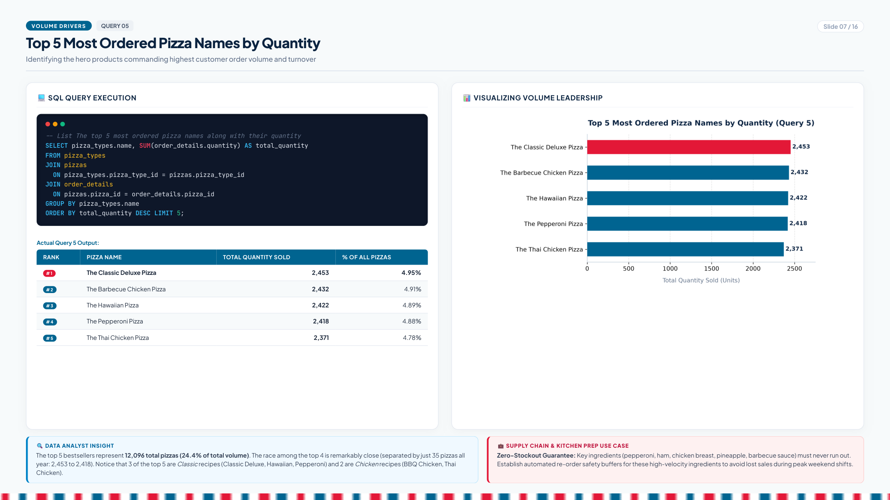

1. **The Classic Deluxe Pizza:** 2,453 pizzas
2. **The Barbecue Chicken Pizza:** 2,432 pizzas
3. **The Hawaiian Pizza:** 2,422 pizzas
4. **The Pepperoni Pizza:** 2,418 pizzas
5. **The Thai Chicken Pizza:** 2,371 pizzas

- **What the data shows:** The competition at the top is tight — just 35 pizzas separate 1st and 4th place over the entire year. Together, these five pizzas account for **12,096 units (24.4% of total sales)**.
- **Operational takeaway:** Safety stock buffers must be non-negotiable for pepperoni, ham, chicken breast, pineapple, and BBQ sauce. Running out of any of these directly damages nearly a quarter of daily sales.

---

### 4. Hourly Demand: Lunch Rush vs. Dinner Peak (Query 6)

```sql
-- Query 6: Orders by hour of the day
SELECT HOUR(time) AS hour, COUNT(order_id) AS order_count 
FROM orders
GROUP BY hour
ORDER BY hour;
```

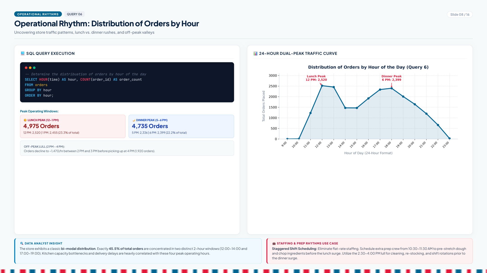

- **What the data shows:** The store experiences a classic **twin-peak daily rhythm**:
  - **Lunch Rush (12:00 PM – 1:00 PM):** 4,975 orders (23.3% of daily business)
  - **Dinner Rush (5:00 PM – 6:00 PM):** 4,735 orders (22.2% of daily business)
  - **Mid-Afternoon Valley (2:00 PM – 4:00 PM):** Volume drops to ~1,470 orders/hour.
- **Operational takeaway:** Flat staffing doesn't work for this store. Split shifts (11:00 AM – 2:30 PM and 4:30 PM – 9:00 PM) double line and driver capacity when orders spike, while the 2:30–4:00 PM valley should be reserved for dough stretching, vegetable slicing, and box folding.

---

### 5. Top Revenue Pizzas & The "Chicken Premium Effect" (Query 7)

```sql
-- Query 7: Top 3 pizzas by total revenue
SELECT pizza_types.name, 
       ROUND(SUM(pizzas.price * order_details.quantity), 2) AS Total_revenue
FROM pizza_types 
JOIN pizzas ON pizza_types.pizza_type_id = pizzas.pizza_type_id
JOIN order_details ON pizzas.pizza_id = order_details.pizza_id
GROUP BY pizza_types.name 
ORDER BY total_revenue DESC LIMIT 3;
```

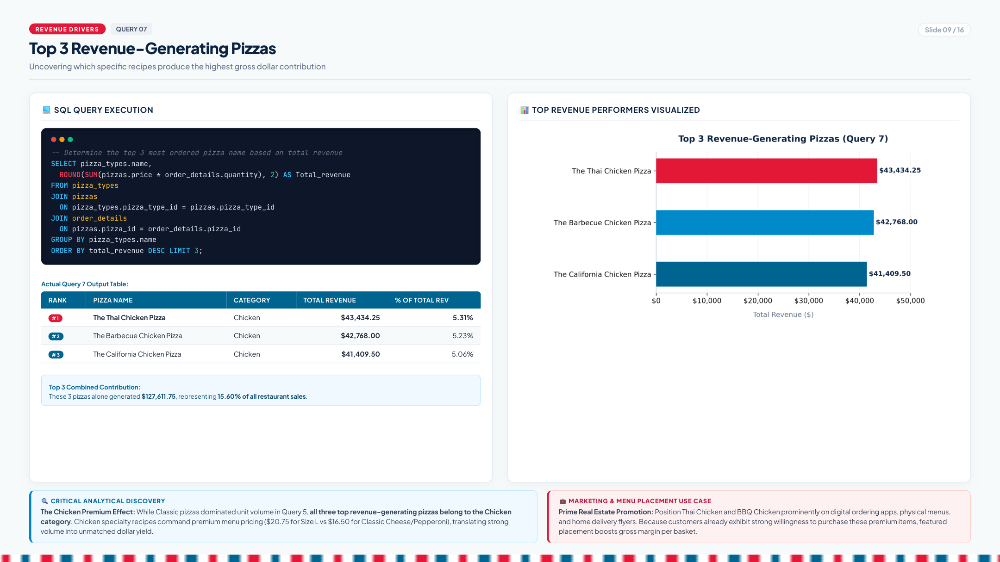

1. **The Thai Chicken Pizza:** **$43,434.25**
2. **The Barbecue Chicken Pizza:** **$42,768.00**
3. **The California Chicken Pizza:** **$41,409.50**

- **Key Analytical Discovery:** Even though Classic Deluxe sold the most physical units, **all top three revenue-generating pizzas come from the Chicken category**. Because chicken specialty pizzas sell at higher price points ($20.75 for Large vs $16.50 for Classic Deluxe), they convert customer demand into higher dollar sales. These three pizzas alone generated **$127,611.75 (15.6% of total revenue)**.

---

### 6. Category Breakdown & SKU Productivity (Queries 8, 9 & 10)

```sql
-- Query 8: Category revenue percentage using CTE
WITH ppp AS (
  SELECT pizza_types.category, 
         ROUND(SUM(pizzas.price * order_details.quantity), 2) AS Total_revenue 
  FROM pizza_types 
  JOIN pizzas ON pizza_types.pizza_type_id = pizzas.pizza_type_id
  JOIN order_details ON pizzas.pizza_id = order_details.pizza_id
  GROUP BY pizza_types.category
  ORDER BY total_revenue DESC
)
SELECT category, 
       CONCAT(ROUND((total_revenue / (SELECT SUM(total_revenue) FROM ppp)) * 100, 2), "%") AS Percentage
FROM ppp;
```

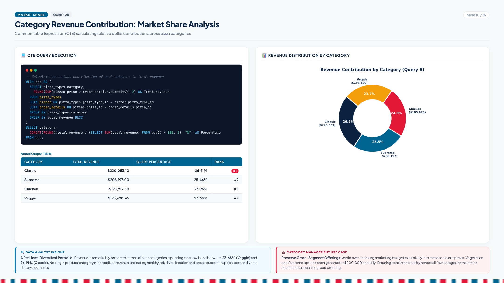

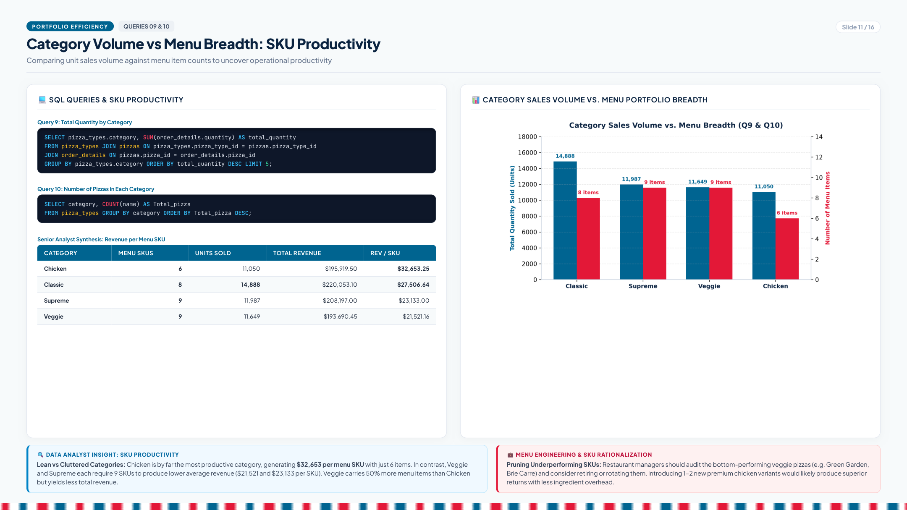

| Category | Menu SKUs | Total Quantity Sold | Total Revenue | Revenue Share | Revenue per Menu SKU |
| :--- | :---: | :---: | :---: | :---: | :---: |
| **Chicken** | **6** | 11,050 | $195,919.50 | 23.96% | **$32,653.25** (Leader) |
| **Classic** | 8 | 14,888 | $220,053.10 | 26.91% | $27,506.64 |
| **Supreme** | 9 | 11,987 | $208,197.00 | 25.46% | $23,133.00 |
| **Veggie** | 9 | 11,649 | $193,690.45 | 23.68% | $21,521.16 |

- **What the data shows:**
  - Revenue is well-diversified: all four categories bring in between 23.7% and 26.9% of total dollars.
  - **Menu Productivity:** Chicken is the leanest and most profitable category per item. With only 6 recipes, it pulls in **$32,653 per SKU**. Meanwhile, Veggie needs 9 recipes to pull in $21,521 per SKU.
  - **Recommendation:** Prune slow-selling vegetarian recipes (like Green Garden or Brie Carre) to save prep time and waste, and test 1–2 seasonal chicken recipes.

---

### 7. Monthly Revenue & Chronological Sorting (Query 11)

```sql
-- Query 11: Month-wise revenue (original query)
SELECT MONTHNAME(orders.date) AS month, 
       ROUND(SUM(pizzas.price * order_details.quantity), 2) AS Total_revenue 
FROM orders 
JOIN order_details ON orders.order_id = order_details.order_id
JOIN pizzas ON pizzas.pizza_id = order_details.pizza_id
GROUP BY month;

-- Senior Analyst Enhancement (Chronological Ordering):
SELECT MONTH(orders.date) AS month_num, 
       MONTHNAME(orders.date) AS month,
       ROUND(SUM(pizzas.price * order_details.quantity), 2) AS Total_revenue
FROM orders 
JOIN order_details ON orders.order_id = order_details.order_id
JOIN pizzas ON pizzas.pizza_id = order_details.pizza_id
GROUP BY month_num, month 
ORDER BY month_num ASC;
```

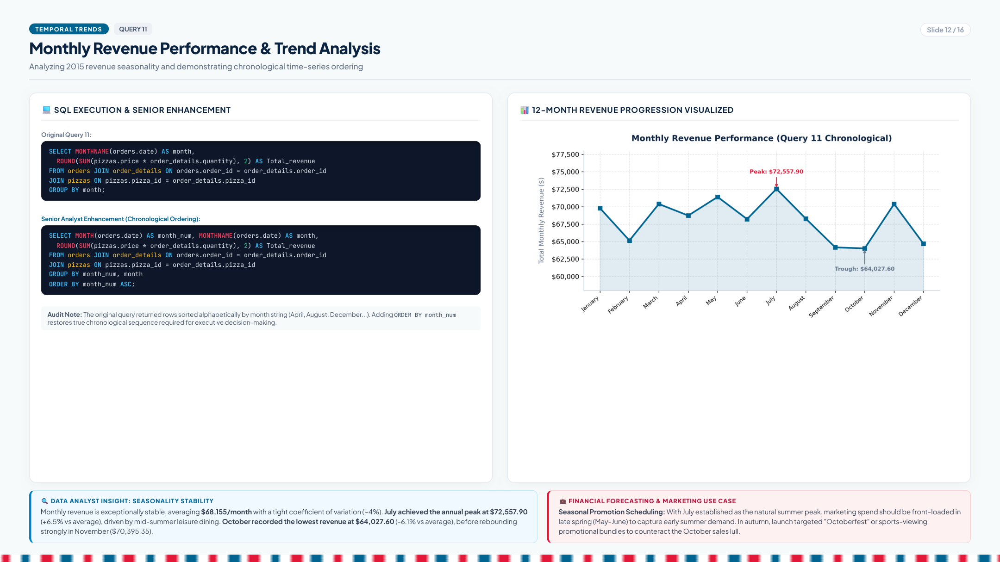

- **Audit Note on Query 11:** The original query grouped by `monthname(date)` without ordering by month integer, which outputs months in alphabetical order (April, August, December...). In commercial reporting, time-series data must follow chronological sequence.
- **Seasonality Finding:** Sales are remarkably stable throughout the year, hovering within a tight range of **$64,000 to $72,500 per month**.
  - **Summer Peak:** **July** is the highest month ($72,557.90) due to vacation dining and outdoor gatherings.
  - **Fall Trough:** **October** is the slowest month ($64,027.60), before bouncing right back in November ($70,395.35).

---

## 💡 Practical Recommendations for Store Managers

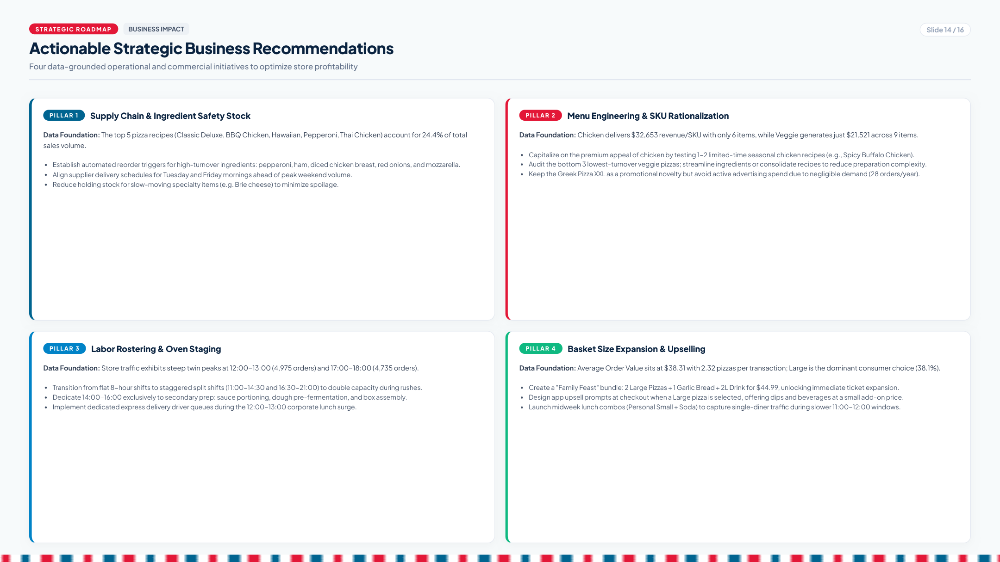

1. **Protect Core Toppings:** The top 5 pizzas drive 24.4% of all orders. Set automated supplier reorders for Tuesday and Friday mornings for mozzarella, pepperoni, chicken breast, ham, and pineapple.
2. **Trim Veggie SKUs, Expand Chicken:** Chicken brings in $32.6K per item while Veggie brings in $21.5K across 9 items. Retire bottom-selling veggie items and introduce a seasonal Buffalo or Chipotle Chicken special.
3. **Stagger Driver & Kitchen Shifts:** 45.5% of sales happen in two windows (12–1 PM and 5–6 PM). Double staffing during those hours, and use 2:30–4:00 PM strictly for box assembly and prep.
4. **Bundle to Lift Ticket Size:** Current AOV is $38.31 with 2.32 pizzas per ticket. Offer a *"Family Meal Deal"* (2 Large Pizzas + 1 Garlic Bread + 2L Soda) for $44.99 to push ticket averages past $45.

---

## 💻 How to Run This Project Locally

### 1. Clone the repository:
```bash
git clone https://github.com/<your-username>/dominos-sql-analysis.git
cd dominos-sql-analysis
```

### 2. Import into MySQL:
```bash
# Open MySQL CLI
mysql -u root -p

# Inside MySQL:
source Dominos_CreateTable.sql;

# Load data from CSVs (or use MySQL Workbench Table Data Import Wizard)
```

### 3. Run the analytical queries:
```sql
source Dominos_Query.sql;
```

---

## 🛠️ Tech Stack & Tools
- **Database Engine:** MySQL 8.0 (DDL, `INNER JOIN`, `LEFT JOIN`, CTEs, date/time functions)
- **Data Audit & Python Tooling:** Python 3.14, Pandas, Matplotlib, Seaborn, PyMuPDF
- **Presentation Engineering:** HTML5 / CSS3 Print Engine (Headless Google Chrome PDF compiler) & `python-pptx`

---

## 👤 Author
**Akshat Raghav**  
*Data Analyst & SQL Developer*  
- Email: akshatraghav22@zohomail.in  
- Portfolio Deliverable: Domino's Pizza SQL Analysis
